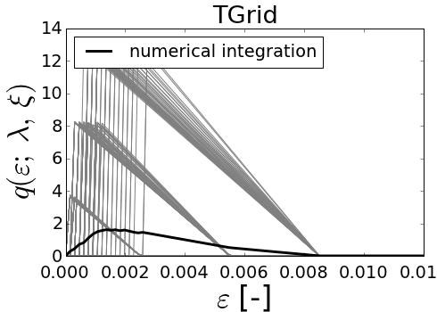
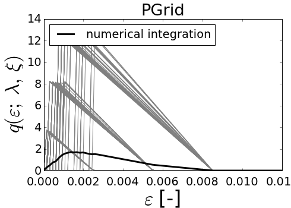
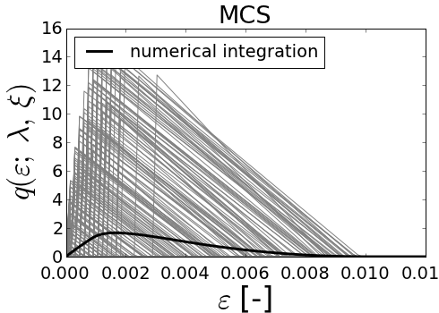
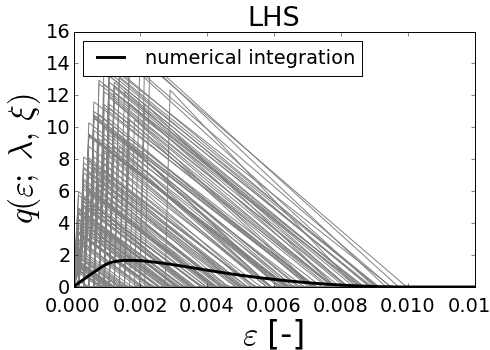
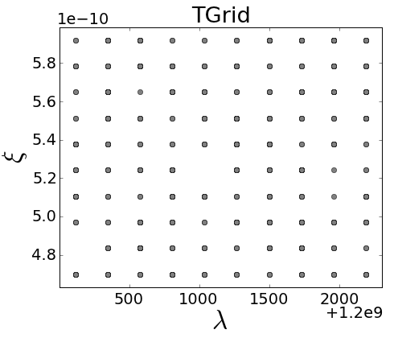
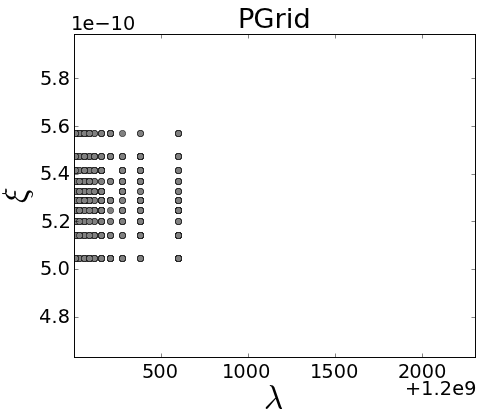
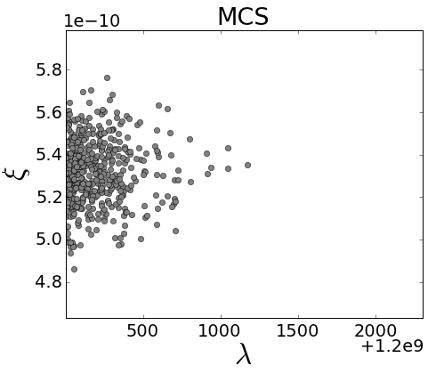
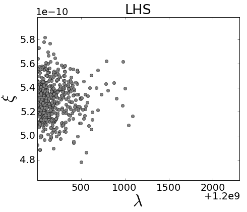
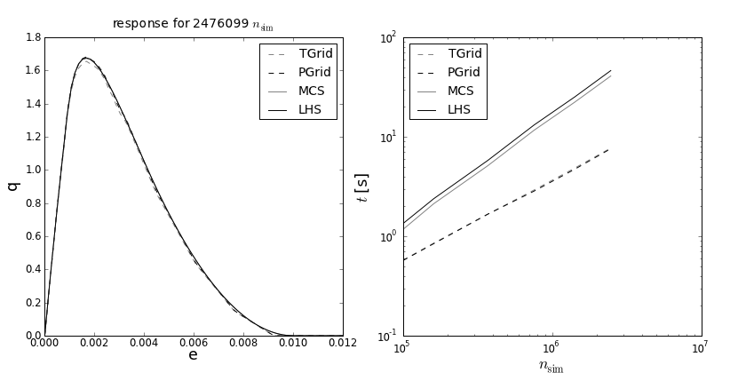
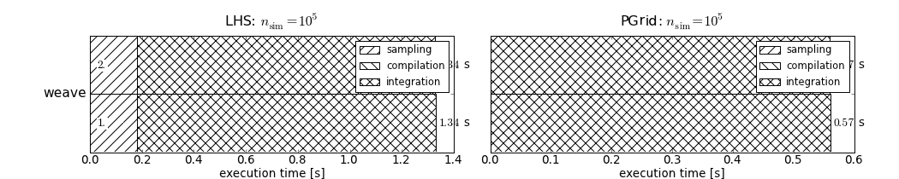

================================
Parametric study for fiber_po_8p
================================
        
Fiber with constant friction
============================

Function describing the pullout of a fiber decomposed into the stage of 
debonding and pullout as:

..    math:: 
    P(w; f_\mathrm{u}, q_\mathrm{f}, L, A, E, z, \varphi, f) = P_\mathrm{deb} + P_\mathrm{pull}\\

During the debonding process, the force is obtained as 

..    math::
    P_\mathrm{deb, full} = \sqrt{2EAq_\mathrm{f}w} e^{f\varphi }

Once the debonding reaches the end of the fiber, the pullout force is calculated as

..    math::
    P_\mathrm{pull, full} = \left[ \ell_\mathrm{e}q_\mathrm{f} - \frac{\ell _\mathrm{e}q_\mathrm{f}}{\ell _\mathrm{e} - w_\mathrm{deb}} \left( w - w_\mathrm{deb} \right) \right] e^{f\varphi }

..    math::
    w_\mathrm{deb} = \frac{\ell_\mathrm{e}^2 q_\mathrm{f}}{2 E A}

The resulting equation defines the ranges for debbonding and pullout

..    math::
    P_\mathrm{full} = P_\mathrm{deb, full} \cdot
    H\left( w_\mathrm{deb} - w \right) \cdot H\left( w \right)\\
    + P_\mathrm{pull, full} \cdot H\left( w - w_\mathrm{deb} \right)

and includes the breaking strain

..    math::
    P = P_\mathrm{full} \cdot H\left( f_\mathrm{u}A - P_\mathrm{full} \right)

The effective fiber length is given as

..    math::
    \ell _\mathrm{e} = \frac{L}{2} - \frac{z}{\cos \left( \varphi  \right)}

where 
 * :math:`w=` crack width, 
 * :math:`L=` fiber length,
 * :math:`\ell_\mathrm{e}=` embedded length, 
 * :math:`\varphi=` orientation angle of the fiber, 
 * :math:`E=` Young's modulus, 
 * :math:`A=` cross-sectional area of fiber, 
 * :math:`z=` distance of fibercentroid from crack plane, 
 * :math:`f=` snubbing coefficient,
 * :math:`w_\mathrm{deb}=` crack width in debonding stage, 
 * :math:`q_\mathrm{f}=` frictional stress, 
 * :math:`f_\mathrm{u}=` strength, 
 * :math:`P_\mathrm{deb}=` force in debonding stage, and 
 * :math:`P_\mathrm{pull}=` force in pullout stage.
 
Comparison of sampling structure
================================

The different types of sampling for sample size 100. Both variables are randomized with 
normal distribution. 
The exact solution is depicted with the black line. The gray lines indicate the sampling. 
The response diagram correspond to the sampling types (left to right):

Regular grid of random variables
Grid of constant probabilities
Monte Carlo sampling
Latin Hypercube Sampling 
    
            

            
            

            
            

            
            

            
                

    
            
                

    
            
                

    
            
                

    
            
Following spirrid configuration has been used to produce the sampling figures:

>>> print demo_object
# function:
q = ConstantFrictionFiniteFiber(w,fu,qf,L,A,E_mod,z,phi,f)
# evars:
w = [0, ..., 0.012] (80)
# tvars[n_int = 10]: 
fu = weibull_min( loc = 1.2e+09, scale = 200, shape = 1)[n_int = None]
qf = 1500.0
L = 0.02
A = norm( loc = 5.30929e-10, scale = 1.59279e-11, shape = 1)[n_int = None]
E_mod = uniform( loc = 7e+10, scale = 2.5e+11, shape = 1)[n_int = None]
z = uniform( loc = 0, scale = 0.03, shape = 1)[n_int = None]
phi = 0.0
f = uniform( loc = 0, scale = 0.03, shape = 1)[n_int = None]
# sampling: TGrid
# codegen: numpy
var_eval: False

Comparison of execution time for different sampling types
=========================================================
Execution time evaluated for an increasing number of sampling points n_sim:

        

            

Comparison of efficiency for different code types
=========================================================
Execution time evaluated for an numpy, weave and cython code:

            

            
