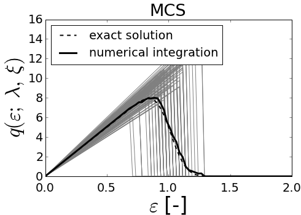
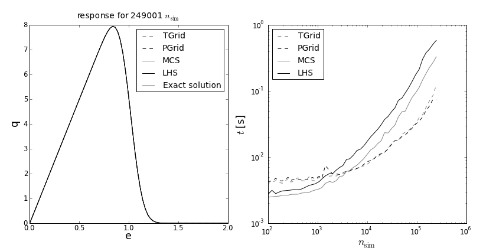

================================
Parametric study for fiber_tt_2p
================================
        
Response Function with two-parameters.
======================================
    
The function describes a linear dependency with a coefficient :math:`\lambda` 
up to the threshold :math:`\xi` and zero value beyond the threshold: 
    
..    math::
       q( \varepsilon; \theta, \lambda ) = \lambda \varepsilon H( \xi - \varepsilon )

where the variables :math:`\lambda=` stiffness parameter and :math:`\xi=` 
breaking strain are considered random and normally distributed. The function 
:math:`H(\eta)` represents the Heaviside function with values 0 for 
:math:`\eta < 0` and 1 for :math:`\eta > 0`.
   
    
Comparison of sampling structure
================================

The different types of sampling for sample size 100. Both variables are randomized with 
normal distribution. 
The exact solution is depicted with the dashed line. The thick black line shows 
the approximate mean response. Gray lines correspond to the sampled realizations.  
The response diagrams correspond to the sampling types (left to right):

+-----------------------------------+
| Regular grid of random variables  |
+-----------------------------------+
| Grid of constant probabilities    |
+-----------------------------------+
| Monte Carlo sampling              |
+-----------------------------------+
| Latin Hypercube Sampling          |
+-----------------------------------+
    
            

            
            

            
            

            
            

            
                

    
            
                

    
            
                

    
            
                

    
            
Following spirrid configuration has been used to produce the sampling figures:

>>> print demo_object
# function:
q = fiber_tt_2p(e,la,xi)
# evars:
e = [0, ..., 2] (80)
# tvars[n_int = 10]: 
la = norm( loc = 10, scale = 1, shape = 1)[n_int = None]
xi = norm( loc = 1, scale = 0.1, shape = 1)[n_int = None]
# sampling: TGrid
# codegen: numpy
var_eval: False

Comparison of computational performance for different sampling types
====================================================================

        

			Execution time evaluated for an increasing number of sampling points n_sim:

        

        

            

Comparison of efficiency for different code types
=========================================================
Execution time evaluated for an numpy, weave and cython code:

            

            
