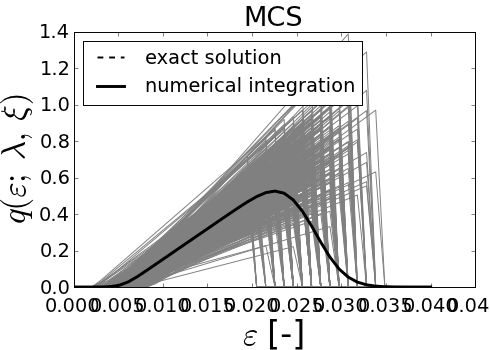
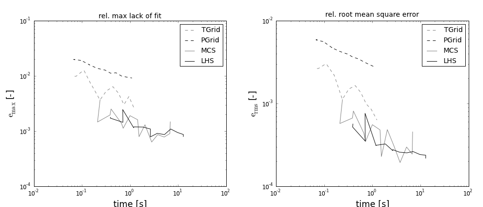

================================
Parametric study for fiber_tt_5p
================================
        
Response function of a single fiber 
===================================

..    math::
    q\left(\varepsilon; E,A,\theta,\lambda,\xi\right) = E A \frac{{\varepsilon
    - \theta \left( {1 + \lambda } \right)}}{{\left( {1 + \theta } \right)
    \left( {1 + \lambda } \right)}}
    H\left[ {e - \theta \left( {1 + \lambda } \right)} \right]
    H\left[ {\xi  - \frac{{e - \theta \left( {1 + \lambda } \right)}}
    {{\left( {1 + \theta } \right)\left( {1 + \lambda } \right)}}} \right]

where the variables :math:`A=` cross-sectional area, :math:`E=` Young's modulus,
:math:`\theta=` filament activation strain, :math:`\lambda=` ratio of extra
(stretched) filament length to the nominal length and :math:`\xi=` breaking strain
are considered random and normally distributed. The function :math:`H(\eta)`
represents the Heaviside function with values 0 for :math:`\eta < 0`
and 1 for :math:`\eta > 0`.

Comparison of sampling structure
================================

The different types of sampling for sample size 100. Both variables are randomized with 
normal distribution. 
The exact solution is depicted with the black line. The gray lines indicate the sampling. 
The response diagram correspond to the sampling types (left to right):

Regular grid of random variables
Grid of constant probabilities
Monte Carlo sampling
Latin Hypercube Sampling 
    
            

            
            

            
            

            
            

            
                

    
            
                

    
            
                

    
            
                

    
            
Following spirrid configuration has been used to produce the sampling figures:

>>> print demo_object
# function:
q = fiber_tt_5p(eps,lambd,xi,E_mod,theta,A)
# evars:
eps = [0, ..., 0.04] (40)
# tvars[n_int = 10]: 
lambd = norm( loc = 0.1, scale = 0.02, shape = 1)[n_int = None]
xi = norm( loc = 0.019027, scale = 0.0022891, shape = 1)[n_int = None]
E_mod = norm( loc = 7e+10, scale = 1.5e+10, shape = 1)[n_int = None]
theta = norm( loc = 0.005, scale = 0.001, shape = 1)[n_int = None]
A = norm( loc = 5.3e-10, scale = 1e-11, shape = 1)[n_int = None]
# sampling: TGrid
# codegen: numpy
var_eval: False

Comparison of execution time for different sampling types
=========================================================
Execution time evaluated for an increasing number of sampling points n_sim:

        

            
        

            
        

            

Comparison of efficiency for different code types
=========================================================
Execution time evaluated for an numpy, weave and cython code:

            

            
